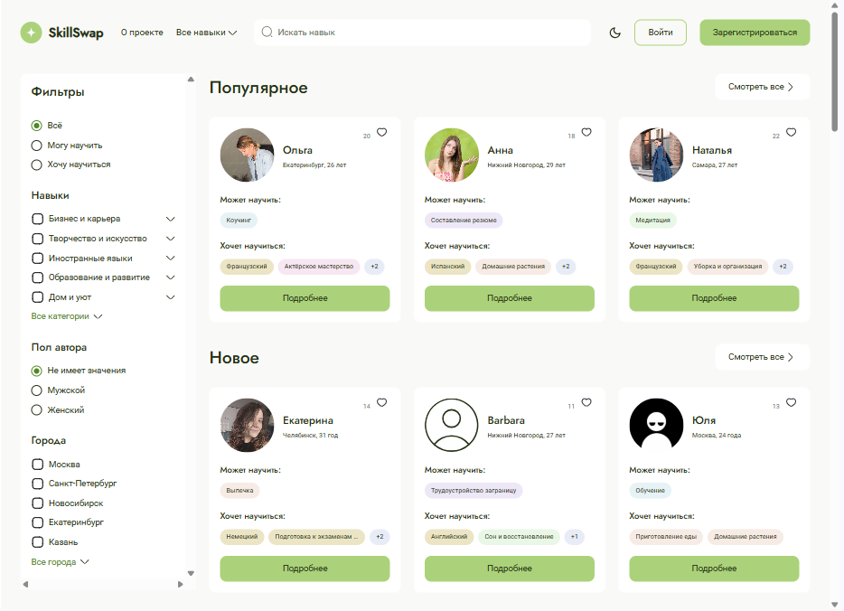
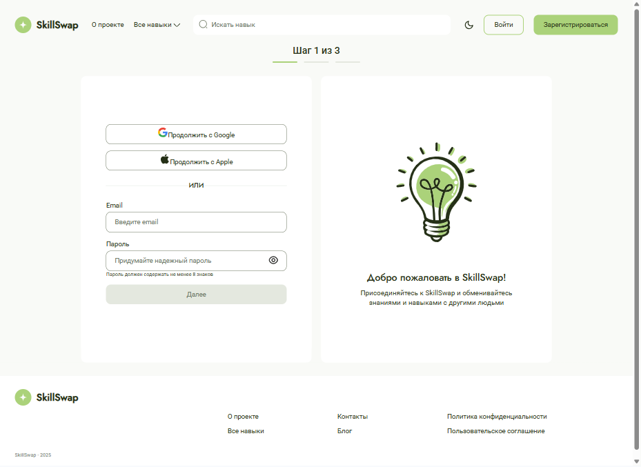

# SkillSwap — платформа для обмена навыками (React)

SkillSwap — это современное одностраничное приложение (SPA), созданное для взаимовыгодного обмена знаниями. Пользователи могут публиковать навыки, которыми готовы поделиться, и навыки, которым хотят научиться. Платформа помогает находить идеальных партнёров для обмена и управлять заявками.

## Особенности реализации

Проект сфокусирован на фронтенд-разработке. Все данные (навыки, пользователи) загружаются из локальных JSON-моков, что имитирует работу с REST API. Состояния, требующие сохранения между сессиями, хранятся в localStorage браузера. Вся бизнес-логика (фильтрация, поиск, сопоставление навыков, валидация форм, уведомления) реализована на стороне клиента.




## Стек

        

## Функциональность

- Каталог навыков: просматривайте предложения «Может научить» и запросы «Хочет научиться» в едином интерфейсе
- Умный поиск и фильтрация: быстрый поиск по названию и фильтрация по типу навыка, городу и полу
- Система обмена: подавайте заявки на интересующие вас навыки. Автор навыка может принять или отклонить предложение
- Личный кабинет: создавайте новые карточки навыков, добавляйте понравившиеся в «Избранное»
- Полный цикл авторизации: многоэтапная регистрация с валидацией, вход и защищённые маршруты
- Интерактивный UI: модальные окна, выпадающие списки, календари, toast-уведомления о действиях других пользователей

## Мой вклад в проект

Я принимала активное участие в разработке в команде из 9 фронтенд-разработчиков. Мои ключевые задачи и реализованный функционал:

#### Архитектура и состояние приложения

- Настроила централизованное управление состоянием: cоздала и настроила хранилище с помощью Redux Toolkit, разработала слайс для работы с данными городов
- Оптимизировала работу со стейтом: выделила ошибки авторизации в отдельное состояние слайса, что улучшило обработку и отображение ошибок для пользователя

#### Разработка компонентов и UI-кит

- Реализовала сложные UI-элементы: кастомный календарь для выбора даты (на базе React Datepicker) с уникальным дизайном согласно макету Figma
- Реализовала универсальный компонент выпадающего списка (на базе react-select) с поддержкой одиночного и множественного выбора и полной стилизацией под проект
- Реализовала компонент Header для неавторизованных пользователей с интегрированной строкой фильтрации
- Реализовала переиспользуемый компонент модального окна, который может отображать любой переданный контент

#### Логика и функциональность

- Реализовала механизм фильтрации: настроила логику поиска и фильтрации карточек навыков по введённому запросу в хедере
- Разработала сложные формы: создала формы для второго и третьего шага регистрации с полной валидацией с использованием React Hook Form и Yup
- Настроила маршрутизацию
- Добавила систему уведомлений при предложении обмена навыками, с использованием localStorage для временного хранения данных

#### Рефакторинг и оптимизация

- Унифицировала управление попапами: добавила общую функцию toggle для открытия и закрытия уведомлений в приложении, что устранило дублирование кода и упростило поддержку

## Установка и запуск

Для установки и запуска проекта необходимо выполнить команды

```
npm install
npm run dev
```

или

```
yarn
yarn dev
```
